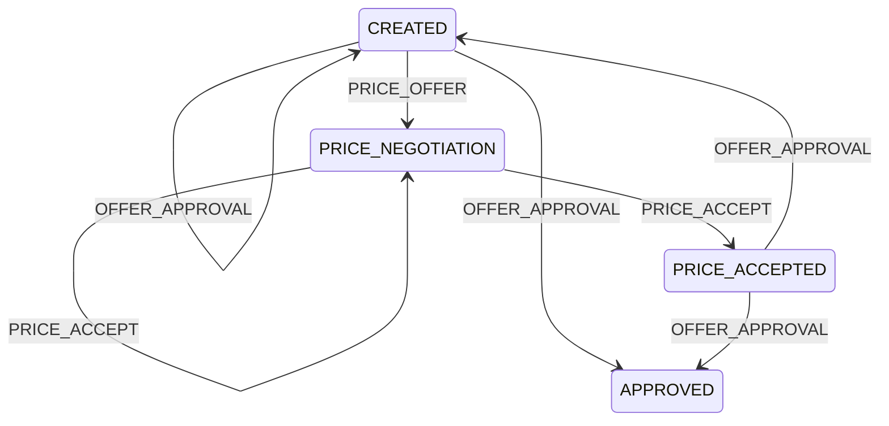

# Encje
User:
```json
{
  "userId": "UUID",
  "displayName": "Marek"
}
```

Conversation:
```json
{
  "conversationId": "UUID",
  "type": "DIRECT | GROUP",
  "participants": ["userUUID"],
  "createdAt": "timestamp",
  "name": "Kraków -> Warszawa",
  "date": "timestamp"
}
```
date mówi o dacie przejazdu

| Typ    | Dozwolone akcje             |
| ------ | --------------------------- |
| DIRECT | negocjacje, propozycje ceny |
| GROUP  | location sharing            |
| oba    | tekst                       |
## Message
```json
{
  "messageId": "UUID",
  "conversationId": "UUID",
  "senderId": "UUID",
  "type": "TEXT | PRICE_OFFER | PRICE_ACCEPT | OFFER_APPROVAL | LOCATION | READ",
  "payload": {},
  "createdAt": "timestamp"
}
```

TEXT:
```json
"type": "TEXT",
"payload": {
  "text": "Hej, jedziesz jutro?"
}
```

PRICE_OFFER:
```json
"type": "PRICE_OFFER",
"payload": {
  "amount": 45.0,
  "currency": "PLN"
}
```

PRICE_ACCEPT:
```json
"type": "PRICE_ACCEPT",
"payload": {}
```

OFFER_APPROVAL
```json
"type": "OFFER_APPROVAL",
"payload": {}
```

LOCATION:
```json
"type": "LOCATION",
"payload": {
  "lat": 52.2297,
  "lng": 21.0122
}
```
payload zależy od tego jaki układ geodezyjny przyjmujemy

READ:
```json
"type": "READ",
"payload": {}
```
komunikat o przeczytaniu wiadomości przez usera

# API
## Error response
```json
422 Unprocessable Entity
{
  "error": {
    "code": "INVALID_MESSAGE_TYPE",
    "message": "PRICE_OFFER is not allowed in GROUP conversation",
    "details": {
      "conversationType": "GROUP"
    },
    "requestId": "req-7fa23"
  }
}
```
`code` przekazuje wewnętrzny kod błędu
`message` można przekazać na frontend i wyświetlić userowi
zawartość `details` się okaże przy implementacji, bo ciężko jest z góry przewidzieć wszystkie szczegóły wszystkich błędów 

| Kod                           | Kiedy używać                   |
| ----------------------------- | ------------------------------ |
| **200 OK**                    | pobranie danych                |
| **201 Created**               | utworzenie zasobu              |
| **400 Bad Request**           | niepoprawny JSON / brak pola   |
| **401 Unauthorized**          | brak tokena                    |
| **403 Forbidden**             | brak uprawnień                 |
| **404 Not Found**             | conversation nie istnieje      |
| **409 Conflict**              | konflikt stanu                 |
| **422 Unprocessable Entity**  | logicznie niepoprawna operacja |
| **429 Too Many Requests**     | rate limit                     |
| **500 Internal Server Error** | database crash                 |


## POST /conversations
Request
```json
{
  "type": "DIRECT",
  "participants": ["userUUID"],
  "name": "Kraków -> Warszawa",
  "date": "timestamp"
}
```

Response
```json
201 Created
{
  "conversationId": "UUID"
}
```

## GET /conversations
Request:
```json
{
	"updatedAfter": "timestamp",
	"fromConversation": 51,
	"toConversation": 100
	"userID": "UUID"
}
```

Response:
```json
200 OK
[
  {
    "conversationId": "UUID",
    "type": "GROUP",
    "name": "Kraków -> Warszawa",
	"date": "timestamp",
    "lastMessagePreview": "Driver shared location",
    "lastMessageAt": "timestamp",
    "unreadCount": 4
  }
]
```

każdy obiekt w tablicy to jedna konwersacja, same wiadomości są obsługiwane przez inne zapytanie

## POST /messages
Request
```json
{
  "conversationId": "UUID",
  "type": "PRICE_OFFER",
  "payload": {
    "amount": 50,
    "currency": "PLN"
  }
}
```

Response:
```json
201 Created
{
  "messageId": "UUID"
}
```

Backend validation:
```
if conversation.type == GROUP
	reject PRICE_OFFER, PRICE_ACCEPT, OFFER_APPROVAL
if conversation.type == DIRECT
	reject LOCATION
```

## GET /conversations/{id}/messages
Request:
```json
{
	"updatedAfter": "timestamp",
	"fromMessage": 51,
	"toMessage": 100
}
```

Response:
```json
200 OK
[
  {
    "messageId": "UUID",
    "senderId": "UUID",
    "type": "TEXT",
    "payload": {
      "text": "OK"
    },
    "createdAt": "timestamp"
  }
]
```
## GET /messages/sync

Request:
```json
{
  "lastReceivedAt": "timestamp"
}
```

Response:
```json
200 OK
{
  "messages": [...],
  "serverTimestamp": "timestamp"
}
```

User wysyła request z timestampem ostatniej wiadomości jaką ma po swojej stronie, a serwer zwraca wszystkie wiadomości tego usera jakie są na serwerze po tym timestampie

# State Machine stanu DIRECT konwersacji

System trzyma obiekt maszyny stanów dla każdej direct konwersacji

OFFER_APPROVAL i PRICE_ACCEPT obierają wyjście zależnie od tego ile osób zatwierdziło, jeśli jedna to idą w siebie, jeśli obie to przechodzą do następnego odpowiedniego sobie stanu

przejście CREATED --> APPROVED wywoła się, gdy nie ma targowania się o cenę

# Backend verification
- Czy sender należy do conversation
- Czy typ wiadomości jest legalny:```
	if conversation.type == GROUP
		reject PRICE_OFFER, PRICE_ACCEPT, OFFER_APPROVAL
	if conversation.type == DIRECT
		reject LOCATION```
- W przypadku location czy sender jest driverem
- Czy użytkownik może wywołać danego POSTa/GETa

# Storage
Messages - append-only table, indeksowane `(conversationId, createdAt)`, partycjonowane po `conversationId` (liczba partycji? chat proponuje 32)
Conversations - relacyjna baza danych
## Redis dla realtime komunikacji
Zapytania idą najpierw do redisa, jeśli on padł z jakiegoś powodu, to idą do bay danych

Eviction policy - co ma wyrzucać gdy zapełni RAM (`allkeys-lru` lub `volatile-lru`)
Connection pool zamiast połączenia per request
### 1. Kanały pub/sub (TODO: do ogarnięcia)

```
conversation:{conversationId}
```

Publikowany event:
```json
{
  "event": "NEW_MESSAGE",
  "conversationId": "uuid",
  "messageId": "uuid",
  "senderId": "uuid",
  "timestamp": 1715853000
}
```

### 2. Kanały użytkownika

```
user:{userId}
```

### 3. Presence (online/offline)

```
online:user:{userId}
```
Typ: `STRING`

```
SET online:user:123 1 EX 60
```
Klient wysyła heartbeat co ~30 s.
Brak klucza ⇒ offline.
***
Opcjonalnie:

```
online:conversation:{conversationId}
```
Typ: `SET`

Lista aktywnych uczestników.

### 4. Unread Messages Cache
```
unread:{userId}
```
Typ: `HASH` `conversationId → unreadCount`

Przykład:
```
HSET unread:userA conv1 5
HINCRBY unread:userA conv1 1
```
### 5. Read Receipts
```
read:{conversationId}:{userId}
```

Typ: `INT` (sequence number wiadomości - która to wiadomość w konwersacji)
```
read:conv1:userA → message123
```
### 6. Conversation Preview Cache

```
conversation:preview:{conversationId}
```
Typ: `HASH`

```json
{
  "lastMessageId": "...",
  "lastMessageText": "...",
  "lastMessageAt": "...",
  "senderId": "..."
}
```

Aktualizowane przy wysłaniu wiadomości.

### 7. Typing Indicators

```
typing:{conversationId}
```
Typ: `SET`

```
SADD typing:conv1 userA
EXPIRE typing:conv1 10
```

Automatycznie znika.

### 8. Driver publikuje lokalizację realtime.

```
location:conversation:{conversationId}
```
Typ: `HASH`

```
lat → float
lng → float
timestamp → unix
driverId → UUID
```

TTL ~30 s.

### 9. Active Conversations Cache
Przyspiesza listę rozmów użytkownika.

```
user:conversations:{userId}
```
Typ: `SORTED SET`

Score = timestamp ostatniej wiadomości.

```
ZADD user:conversations:userA 1715853000 conv1
```

Dzięki temu:
```
GET /conversations
```
jest O(log N).

### 10. Rate Limiting (anty-spam)

```
ratelimit:user:{userId}:messages
```

```
INCR
EXPIRE 10
```

Np. max 20 wiadomości / 10 s.

# Realtime delivery
WebSocket żeby powiadamiać użytkowników:
```
AUTH TOKEN
SUBSCRIBE conversations
```

Serwer pushuje:
```json
{
  "event": "NEW_MESSAGE",
  "message": {...}
}
```
Fallback: /messages/sync

TODO: rozpisać

# Event flow
Send Message
 → validate
 → save message
 → publish event
 → notify users
 → update read models

# Inne
Łatwo da się rozszerzyć o E2EE, wystarczy dodać nowe typy wiadomości (każdy typ -> encrypted typ)

Redis cluster - przy skalowaniu, gdy sam redis nie będzie wystarczał