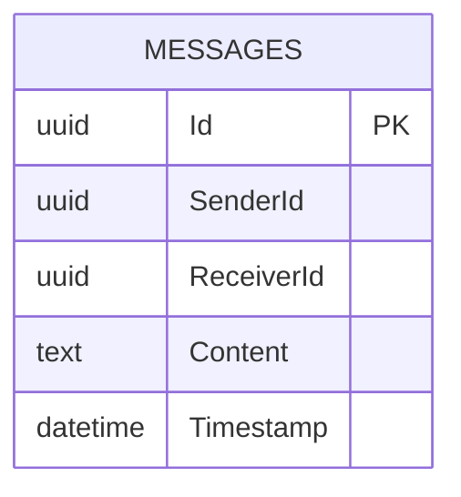
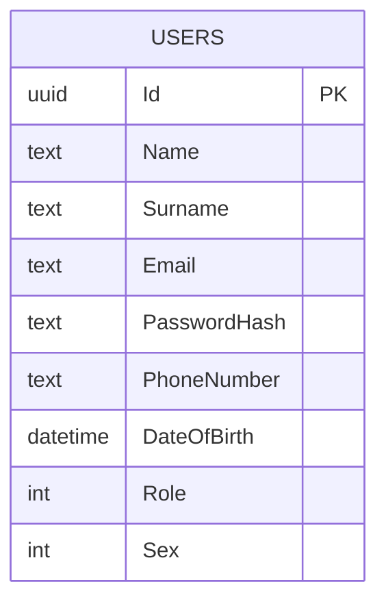
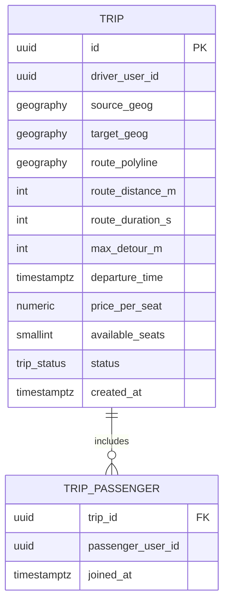

# Database Schema

The system uses three separate databases.

---

## app_db (PostgreSQL 16)

Managed by `AppDbContext` (EF Core migrations in `src/Infrastructure/Migrations/`).

> **Note:** `app_db` previously contained `Trips`, `Routes`, and `TripRequests` tables from the old TripPlanner layer. Those entities have been removed from the code. The tables still exist in the DB from historical migrations but are no longer used.

---

## users_db (PostgreSQL 16)

Managed by `UsersDbContext` (EF Core migrations in `src/Users/Migrations/`).

| Enum | Values |
|---|---|
| `Role` | `0 = REGULAR_USER`, `1 = ADMIN` |
| `Sex` | `0 = MALE`, `1 = FEMALE`, `2 = OTHER` |

---

## trip_db (PostGIS 16)

Managed by raw SQL init scripts in `docker/trip-db/init/`. No EF Core — direct Npgsql queries via `TripsV1Service`.

`status` ∈ `ACTIVE` | `COMPLETED`

`route_polyline` is a `geography(LINESTRING, 4326)` — full road geometry computed by Valhalla on trip creation.

**Spatial indexes:**
- `idx_trip_route_polyline` — GiST on `route_polyline` (used by `ST_DWithin` in search Phase 1)
- `idx_trip_departure_active` — on `departure_time` filtered to `status = 'ACTIVE'`
- `idx_trip_driver_active` — on `driver_user_id` filtered to `status = 'ACTIVE'`
- `idx_trip_passenger_user` — on `trip_passenger(passenger_user_id)`

---

## MessageService DB (PostgreSQL)

Managed by `MessageService.Infrastructure.AppDbContext` (EF Core, separate from `app_db`).

`ConversationType` ∈ `0 = Direct` | `1 = Group`

A group conversation is created automatically when a trip is created (`trip_id` links the conversation to the trip).
