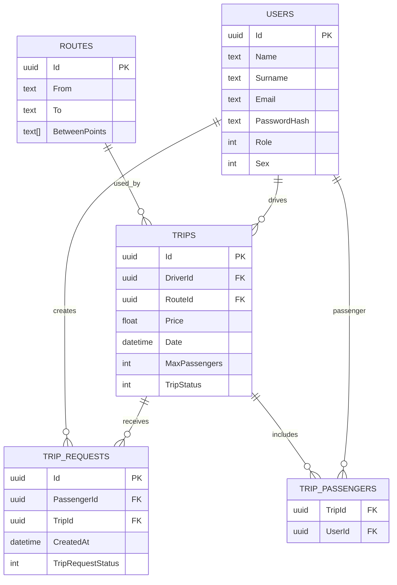

# Database Schema

This diagram reflects the current entity classes and EF Core conventions. Some foreign key columns are inferred from navigation properties, so the exact generated column names can change unless you configure them explicitly in `OnModelCreating`. `TripRequest` is the explicit table that records a passenger asking to join a trip. `Trip.Passengers` may still produce a join table depending on your EF configuration, but the request table is the part that models the workflow.

See [docs/lifecycles.md](docs/lifecycles.md) for the Trip and TripRequest state diagrams.

## Enum values

EF Core stores the `Role`, `Sex`, `TripStatus`, and `TripRequestStatus` enums as integers by default.

`UserRole`

| Value | Name |
| --- | --- |
| 0 | REGULAR_USER |
| 1 | ADMIN |

`Sex`

| Value | Name |
| --- | --- |
| 0 | MALE |
| 1 | FEMALE |
| 2 | OTHER |
| 3 | MARXIST |

`TripStatus`

| Value | Name |
| --- | --- |
| 0 | InActive |
| 1 | Active |
| 2 | Full |
| 3 | Cancelled |
| 4 | Done |
| 5 | Archived |

`TripRequestStatus`

| Value | Name |
| --- | --- |
| 0 | Pending |
| 1 | Rejected |
| 2 | Cancelled |
