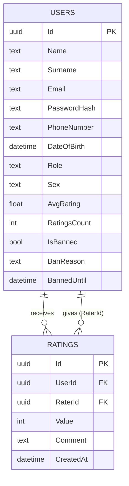
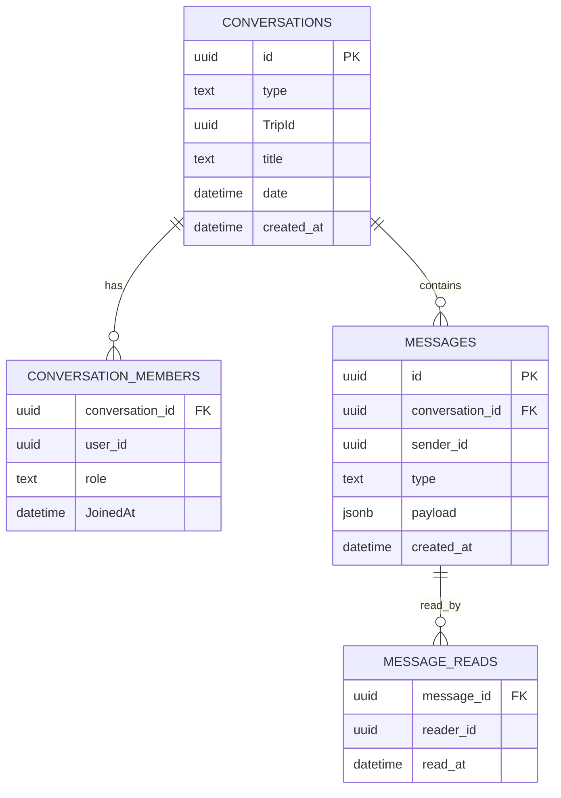
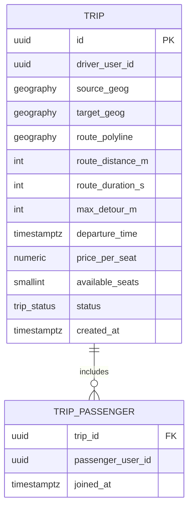

# Database Schema

The system uses three separate PostgreSQL databases across two instances.

---

## app_db (PostgreSQL 16 — `db:5432`)

Managed by `UsersDbContext` (EF Core, migrations in `src/Users/Migrations/`).

| Enum | Values |
|---|---|
| `Role` | `REGULAR_USER`, `ADMIN` |
| `Sex` | `MALE`, `FEMALE`, `OTHER` |

---

## messages_db (PostgreSQL 16 — `db:5432`, separate database)

Managed by `MessageService.Infrastructure.MessagesDbContext` (EF Core, migrations in `src/MessageService/MessageService.Infrastructure/Migrations/`).

`type` (conversation) ∈ `direct` | `group`

A group conversation is created automatically when a trip is created. `TripId` links the conversation to the trip.

---

## trip_db (PostGIS 16 — `trip_db:5433`)

Managed by raw SQL init scripts in `docker/trip-db/init/`. No EF Core — direct Npgsql queries via `TripsService`.

`status` ∈ `ACTIVE` (only value used in practice — trips are hard-deleted, not transitioned to other states)

`route_polyline` is a `geography(LINESTRING, 4326)` — full road geometry computed by Valhalla (or approximated by the mock engine in debug mode).

**Spatial indexes:**
- `idx_trip_route_polyline` — GiST on `route_polyline` (used by `ST_DWithin` in search Phase 1)
- `idx_trip_departure_active` — on `departure_time` filtered to `status = 'ACTIVE'`
- `idx_trip_driver_active` — on `driver_user_id` filtered to `status = 'ACTIVE'`
- `idx_trip_passenger_user` — on `trip_passenger(passenger_user_id)`
