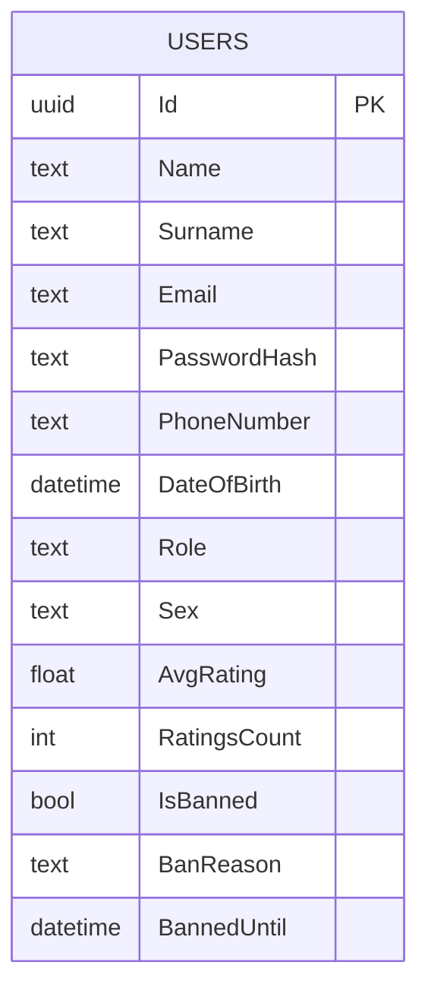
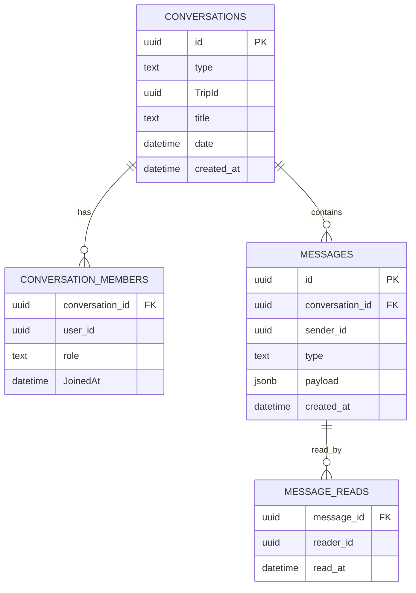
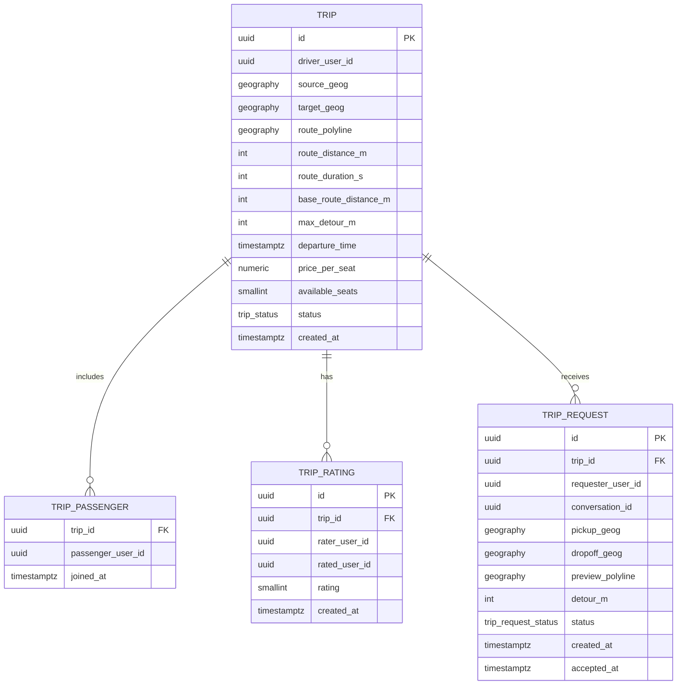

# Database Schema

The system uses three separate PostgreSQL databases across two instances.

---

## app_db (PostgreSQL 16 — `db:5432`)

Managed by `UsersDbContext` (EF Core, migrations in `src/Users/Migrations/`).

| Enum | Values |
|---|---|
| `Role` | `REGULAR_USER`, `ADMIN` |
| `Sex` | `MALE`, `FEMALE`, `OTHER` |

---

## messages_db (PostgreSQL 16 — `db:5432`, separate database)

Managed by `MessageService.Infrastructure.MessagesDbContext` (EF Core, migrations in `src/MessageService/MessageService.Infrastructure/Migrations/`).

`type` (conversation) ∈ `direct` | `group`

A group conversation is created automatically when a trip is created. `TripId` links the conversation to the trip.

---

## trip_db (PostGIS 16 — `trip_db:5433`)

Managed by raw SQL init scripts in `docker/trip-db/init/`. No EF Core — direct Npgsql queries via `TripsService`.

`status` (trip) ∈ `ACTIVE`, `COMPLETED` (in practice only `ACTIVE` — trips are hard-deleted, not transitioned)

`status` (request) — `trip_request_status` ∈ `PENDING`, `ACCEPTED`

`route_polyline` is a `geography(LINESTRING, 4326)` — full road geometry computed by Valhalla (or approximated by the mock engine in debug mode). When a request is accepted the route is **recomputed** through the new pickup/dropoff stops, so `route_polyline`, `route_distance_m` and `route_duration_s` grow.

`base_route_distance_m` is the **immutable** driver-only route distance, captured at trip creation and never changed. Detour calculations (search Phase 2 and trip-request creation) subtract this baseline so they stay consistent no matter how many passengers have already joined.

`trip_request` stores where a passenger wants to be picked up / dropped off, the computed `detour_m` (vs `base_route_distance_m`), the `preview_polyline` shown in the chat map, and a link to the direct `conversation_id`. A partial unique index keeps at most one open (`PENDING`) request per `(trip_id, requester_user_id)`.

**Spatial indexes:**
- `idx_trip_route_polyline` — GiST on `route_polyline` (used by `ST_DWithin` in search Phase 1)
- `idx_trip_departure_active` — on `departure_time` filtered to `status = 'ACTIVE'`
- `idx_trip_driver_active` — on `driver_user_id` filtered to `status = 'ACTIVE'`
- `idx_trip_passenger_user` — on `trip_passenger(passenger_user_id)`
- `idx_trip_rating_rated_user` — on `trip_rating(rated_user_id)`
- `idx_trip_rating_rater_user` — on `trip_rating(rater_user_id)`
- `idx_trip_request_trip` — on `trip_request(trip_id)`
- `idx_trip_request_conversation` — on `trip_request(conversation_id)`
- `uq_trip_request_pending` — partial UNIQUE on `trip_request(trip_id, requester_user_id) WHERE status = 'PENDING'`

**Migrations:** raw SQL in `docker/trip-db/init/` — `004_add_trip_requests.sql` (the `trip_request` table) and `005_add_base_route_distance.sql` (the `base_route_distance_m` column). These run automatically only on a **fresh** `trip_db` volume; apply them manually to an existing volume (see the README).
