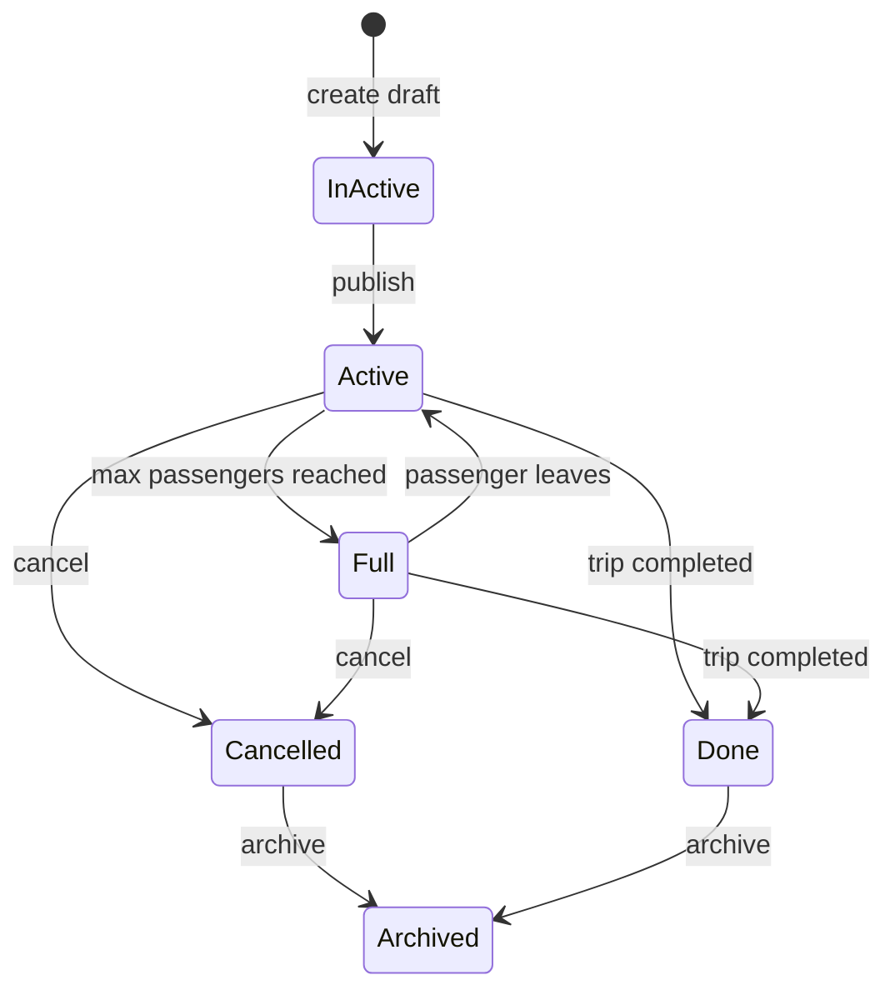

## Trip lifecycle

# Notes
- Inactive — trip entity is created but not yet published.
- Active — trip is published and still has available seats.
- Full — the maximum number of passengers has been reached.
- Cancelled — trip was cancelled by the driver.
- Done — trip has been completed.
- Archived — a cancelled or completed trip has been archived.
