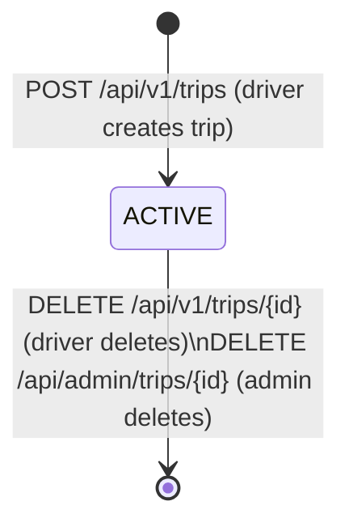

## Trip lifecycle

## Notes
- The only status in the system is **ACTIVE** — a trip is created immediately as active, with no draft phase.
- A trip disappears from active listings automatically once `departure_time` has passed (date filter applied in queries).
- Deleting a trip is a hard delete (removed from the database).
- Past trips remain accessible via `GET /api/v1/trips/history`.
