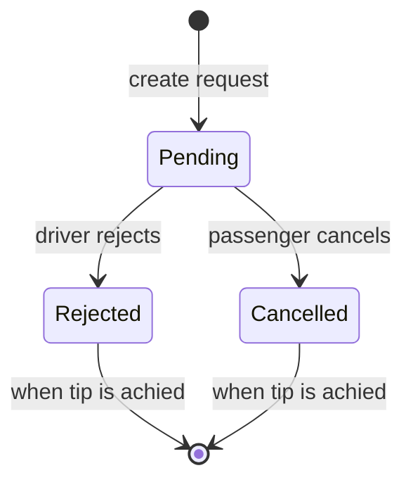

## Trip request lifecycle

# Notes
When an offer is created, the system needs to check whether there is already an existing record in the database. If the offer is pending or rejected, it should not be possible to create another request.

When a trip is archived, the request should be deleted.