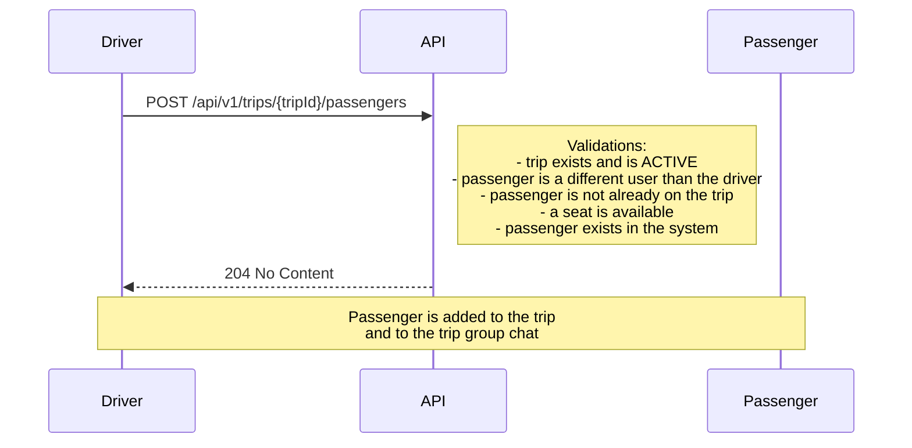

## Passenger flow

The driver adds a passenger directly to a trip — there is no separate request/accept flow.



### Endpoint

`POST /api/v1/trips/{tripId}/passengers`

Body:
```json
{ "passengerId": "<uuid>" }
```

Responses:
- `204` — added successfully
- `400` — no seats available / passenger already on trip / invalid UUID
- `403` — caller is not the driver of this trip
- `404` — trip not found
