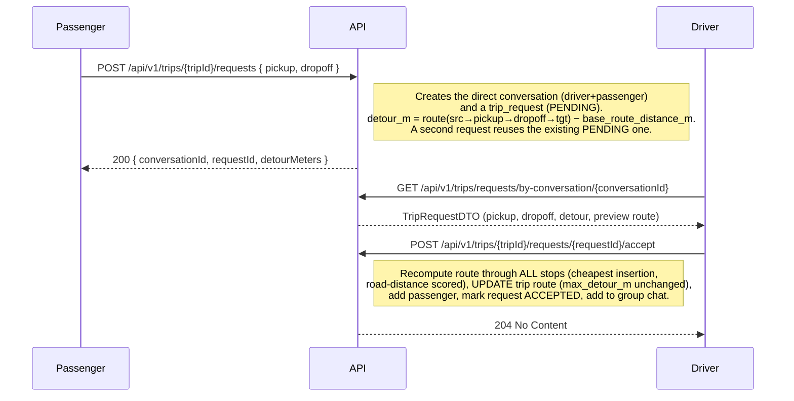
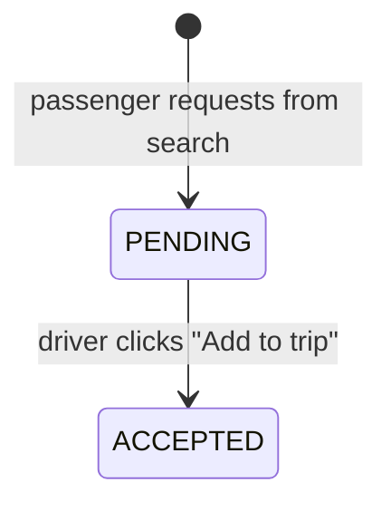

# Trip request lifecycle

A **trip request** lets a passenger ask to join a trip with a specific pickup and
dropoff. When a passenger picks a trip from the search results, the app creates a
direct chat with the driver **and** a `trip_request` storing where they want to be
picked up / dropped off (their search origin/destination) plus the computed detour.
The driver reviews it in the chat and accepts, which recomputes the trip route
through the new stops and adds the passenger.

All endpoints below sit on `TripsOrchestratorController` and require `[Authorize]`,
which resolves to the **`NotBanned`** default policy — banned users are rejected.



## States



There is no reject/cancel state — out of scope (passengers cannot currently be
removed from a trip either).

## Endpoints

### Create a request (passenger)
`POST /api/v1/trips/{tripId}/requests`
```json
{ "pickup": { "lat": 52.23, "lng": 21.0 }, "dropoff": { "lat": 50.06, "lng": 19.94 } }
```
- `200` — `{ conversationId, requestId, detourMeters }` (also returned when an existing PENDING request is reused)
- `400` — requesting your own trip / already a passenger / invalid body
- `404` — trip not found

### Fetch the request behind a conversation (chat panel)
`GET /api/v1/trips/requests/by-conversation/{conversationId}` → `TripRequestDTO`
(pickup, dropoff, `detourMeters`, `previewPolyline`, `status`) or `404`.

### Accept a request (driver)
`POST /api/v1/trips/{tripId}/requests/{requestId}/accept`
- `204` — route recomputed, passenger added, request `ACCEPTED`
- `400` — request no longer pending / trip not active / no seats / already a passenger
- `403` — caller is not the driver
- `404` — trip or request not found

## Route recompute (cheapest insertion)

On accept the new stops are woven into the existing stop order at the **cheapest
positions** (scored by the Valhalla distance matrix), keeping "pickup before its own
dropoff" and never reordering already-accepted passengers. The full ordered list
`source → … → target` is then sent once through the routing engine for the real
geometry. `max_detour_m` is **not** changed — the route simply lengthens; detours
shown to users stay measured against `base_route_distance_m`.

## Direct add (legacy)

The driver can still add a passenger directly without a request via
`POST /api/v1/trips/{tripId}/passengers` (`{ "passengerId": "<uuid>" }`). This does
**not** recompute the route — it only records the passenger and adds them to the
group chat. The request/accept flow above is the primary path used by the UI.
